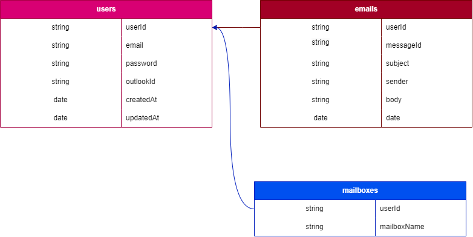

# email-engine-backend


### (Postman) Documentation
We are included the postmen collection in the code devs directory.
To get postmen collection:
- Goto [postman collection](./devs/Email-engine.postman_collection.json)


### ENV(s)
- PORT *(server port number)*
- ELASTIC_USERNAME *(username of elastic)*
- ELASTIC_PASSWORD *(password of elastic)*
- ELASTIC_CLOUD_ID *(cloud id of elastic)*
- OUTLOOK_CLIENT_ID *(client id of outlook)*
- OUTLOOK_CLIENT_SECRET *(client secret of outlook)*
- OUTLOOK_REDIRECT_URI *(redirect url of outlook)*
- JWT_SECRET *(JWT secret key)*
- JWT_TOKEN_EXPIRATION *(JWT expiration like "1h")*
- JWT_REFRESH_SECRET *(JWT secret key)*
- JWT_REFRESH_TOKEN_EXPIRATION *(JWT expiration like "23h")*


### Run Server
- Please start project using `npm start` predefined script if you want to run in prod mode.
- Please start project using `npm run dev` predefined script if you want to run in dev mode. project will be run using nodemon


### Structure Breakdown

```text
├── devs/
│  ├── Email-engine.postman_collection.json (Postman collection)
│  ├── email_engin.drawio
│  └── email_engine.drawio.png
│
├── src/
│  ├── config/
│  │   ├── elasticsearch.js
│  │   └── oauth.js
│  │
│  ├── controllers/
│  │   ├── authController.js
│  │   └── emailController.js
│  │
│  ├── env/
│  │   └── Env.js   (Envs variables are exported for whole app)
│  │
│  ├── handler/
│  │   └── globalError.js
│  │
│  ├── routes/
│  │   ├── authRoutes.js
│  │   └── emailRoutes.js
│  │
│  ├── services/
│  │   ├── elasticsearchService.js
│  │   └── outlookService.js
│  │
│  ├── utils/
│  │   ├── ApiResponse.js
│  │   ├── AppError.js
│  │   ├── catchAsync.js
│  │   ├── signToken.js
│  │   └── constant.js  (constants are exported for whole app)
│  │
│  ├── app.js
│  └── server.js
│
├── .env
├── sample.env
├── .gitignore
├── package.json
└── readme.md
```


### (ERD) Database Design
We are using Draw IO to draw our database map and table details.
To update the design:
- Goto [Draw.io (Web)](https://app.diagrams.net/)
- Import [email_engin_file](./devs/email_engin) into web-app.
- Export as png and replace your file with [email_engin_png](./devs/email_engine.drawio.png).
- Also save and replace source file with [email_engin_file](./devs/email_engin).

#### Latest DB Design

